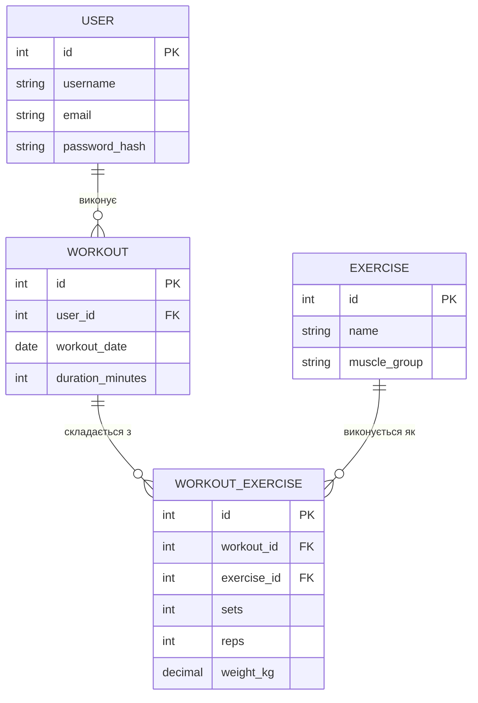

## User:

> 9/27/2026 15:41:26

домен проєкту: трекер тренувань. Сформуй опис домену, сутності з атрибутами, зв'язки між ними та ER-діаграму в синтаксисі Mermaid, дотримуючись вимог завдання (декларативна модель, без фізичної схеми БД, без сполучних таблиць для зв'язків багато-до-багатьох). Додатково згенеруй README.md з коротким описом проєкту

## Assistant:

> 9/27/2026 15:42:29

# Домен: трекер тренувань

## Обґрунтування вибору домену

Трекер тренувань — придатний домен для ER-моделювання, бо містить природний приклад зв'язку "багато-до-багатьох" зі змістовними атрибутами (тренування ↔ вправи), просту ієрархію класифікації (група м'язів → вправа) та історичні дані користувача (особисті рекорди), що дає підставу продемонструвати нормалізацію без штучного ускладнення моделі.

## Сутності та атрибути

**User** (користувач)

- `id` PK, INTEGER
- `username` VARCHAR, унікальний
- `email` VARCHAR, унікальний
- `password_hash` VARCHAR

**Workout** (тренування)

- `id` PK, INTEGER
- `user_id` FK → User.id
- `workout_date` DATE
- `duration_minutes` INTEGER

**Exercise** (вправа)

- `id` PK, INTEGER
- `name` VARCHAR
- `muscle_group` VARCHAR

**WorkoutExercise** (виконання вправи в тренуванні) — асоціативна сутність

- `id` PK, INTEGER
- `workout_id` FK → Workout.id
- `exercise_id` FK → Exercise.id
- `sets` INTEGER
- `reps` INTEGER
- `weight_kg` DECIMAL

## Зв'язки

- **User 1 — \* Workout**: користувач має багато тренувань, тренування належить одному користувачу.
- **Workout _ — _ Exercise через WorkoutExercise**: тренування містить кілька вправ, вправа може входити в кілька тренувань; сам зв'язок несе дані (підходи, повторення, вага), тому оформлений як окрема сутність, а не сполучна таблиця.

## ER-діаграма

GitHub рендерить такий блок автоматично в README.md — окремий рендер-інструмент не потрібен.

## Приклад критеріїв прийняття для spec.md

- Кожне тренування (`Workout`) прив'язане рівно до одного користувача.
- Вправа (`Exercise`) не може існувати без групи м'язів.
- `WorkoutExercise` не дублює тренування-вправу з однаковим `order_index` в межах одного тренування.
- Особистий рекорд оновлюється лише коли нове значення `weight_kg` або `reps` перевищує попереднє для тієї самої пари користувач-вправа.
- Назви полів у spec.md і в діаграмі повністю збігаються (наприклад, `weight_kg`, а не десь `weight`, десь `price`).

## Нормалізація (для DEFENSE.md)

Модель у 3NF: `MuscleGroup` винесено окремо, щоб назва групи не дублювалась у кожному записі `Exercise`; `WorkoutExercise` містить лише факти про конкретне виконання вправи (не копіює дані з `Workout` чи `Exercise`); `PersonalRecord` не залежить транзитивно від жодного нeключового поля іншої сутності.

## README.md

**FitTrack — трекер тренувань**

Застосунок для запису тренувань: користувач фіксує, коли тренувався та які вправи виконував — з якими підходами, повтореннями та вагою.

Суть роботи — ER-модель предметної області: чотири сутності (користувач, тренування, вправа, виконання вправи) та зв'язки між ними, включно зі зв'язком "тренування — вправа", реалізованим як окрема сутність (`WorkoutExercise`), бо він несе власні дані — кількість підходів, повторень і вагу, а не просто поєднує дві таблиці.

Модель описана декларативно (Mermaid `erDiagram`) і відповідає spec.md: назви полів, типи ключів і кардинальності зв'язків узгоджені між описом і діаграмою.

## User:

> 9/27/2026 16:10:43

модель містить три зв'язки: User-Workout, Workout-WorkoutExercise, WorkoutExercise-Exercise. Визнач кардинальність кожного зв'язку у форматі 1:1/1:N/N:N та сформулюй словесний опис для кожного. Також сформулюй критерії прийняття моделі для spec.md

## Assistant:

> 9/27/2026 16:10:49

## Зв'язки

**User — Workout: 1:N**
Один користувач має багато тренувань; кожне тренування належить рівно одному користувачу.

**Workout — WorkoutExercise: 1:N**
Одне тренування складається з кількох виконаних вправ; кожен запис `WorkoutExercise` належить рівно одному тренуванню.

**Exercise — WorkoutExercise: 1:N**
Одна вправа може зустрічатися в багатьох виконаннях (у різних тренуваннях); кожен запис `WorkoutExercise` посилається рівно на одну вправу.

Формально всі три зв'язки — 1:N (жодного прямого 1:1 чи N:N немає). Зв'язок N:N є лише на рівні Workout ↔ Exercise концептуально — він виражений не напряму, а через асоціативну сутність `WorkoutExercise`: з боку `Workout` це 1:N, з боку `Exercise` теж 1:N, а разом вони й дають ефект "багато тренувань — багато вправ", тільки зі власними атрибутами (sets, reps, weight_kg) на кожному перетині.

## Критерії прийняття (для spec.md)

- Кожне тренування (`Workout`) прив'язане рівно до одного користувача (`user_id` обов'язкове, FK на `User.id`).
- Кожен запис `WorkoutExercise` прив'язаний рівно до одного тренування і рівно до однієї вправи (`workout_id` і `exercise_id` обов'язкові).
- `sets`, `reps` — цілі додатні числа; `weight_kg` — невід'ємне число (0 допустимо для вправ без обтяження).
- Тренування без жодного запису `WorkoutExercise` — допустимий стан (наприклад, ще не заповнене), але не повинно вважатися помилкою моделі.
- Видалення `Exercise`, на яку є посилання в `WorkoutExercise`, заборонене або обробляється явно (щоб не лишались "осиротілі" записи).
- Типи первинних і зовнішніх ключів узгоджені: всюди `INTEGER`, без змішування з `string`/`UUID`.
- Назви полів у spec.md, ER-діаграмі та коді повністю збігаються (наприклад, `weight_kg` — однаково всюди, а не `weight` в одному місці й подібна назва в іншому).

Powered by Claude Exporter (https://www.ai-chat-exporter.net)
