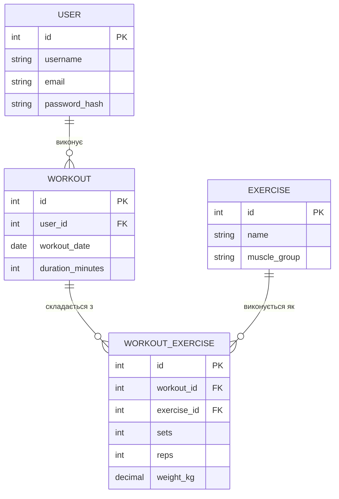

```mermaid
erDiagram
    USER ||--o{ WORKOUT : "виконує"
    WORKOUT ||--o{ WORKOUT_EXERCISE : "складається з"
    EXERCISE ||--o{ WORKOUT_EXERCISE : "виконується як"

    USER {
        int id PK
        string username
        string email
        string password_hash
    }
    WORKOUT {
        int id PK
        int user_id FK
        date workout_date
        int duration_minutes
    }
    EXERCISE {
        int id PK
        string name
        string muscle_group
    }
    WORKOUT_EXERCISE {
        int id PK
        int workout_id FK
        int exercise_id FK
        int sets
        int reps
        decimal weight_kg
    }
```
